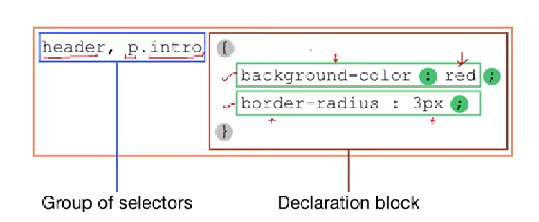

## **Basic CSS Syntax**
(Just a markdown practice)
> p { color: blue; }

If you look at the  line above, *p* is the **selector** in this case. After that, comes the curly brackets. In that, *color* is the **property name** that is to be modified. After that, a colon is placed beyond which, the **value** for the **property** is given which in this case is *blue*

  
